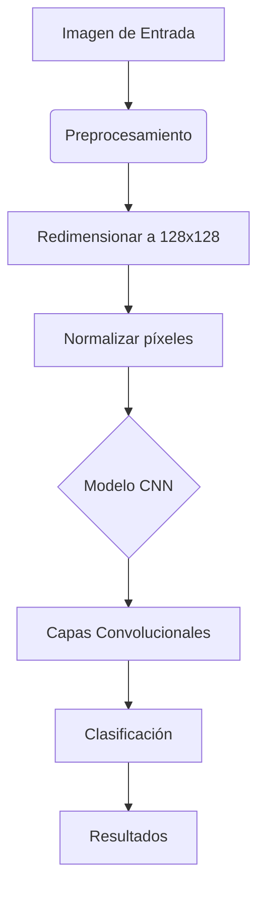

# Identificador de Comida Chatarra con IA 🍔🍕🍦

Un clasificador de imágenes que utiliza redes neuronales convolucionales (CNN) para identificar 4 tipos de comida chatarra: hamburguesas, pizza, helado y tiramisú.

## Características ✨

- **Clasificación precisa**: Detecta entre 4 categorías de comida chatarra con un modelo CNN entrenado
- **Interfaz amigable**: Diseño moderno y responsive con Tailwind CSS
- **Fácil de usar**: Arrastra y suelta imágenes o selecciónalas desde tu dispositivo
- **Visualización de resultados**: Muestra porcentajes de confianza y comparativas
- **Optimizado**: Procesamiento eficiente en el navegador con TensorFlow.js

## Tecnologías Utilizadas 🛠️

<p align="center">
  
  
  
  
</p>

## Cómo Funciona 🤖

Instalación Local 🚀
Clona el repositorio:
bash
git clone https://github.com/tu-usuario/identificador-comida-chatarra.git
cd identificador-comida-chatarra

Sirve los archivos con:
bash
python -m http.server 8000

Abre en tu navegador:
http://localhost:8000

Estructura del Proyecto 📂
identificador-comida-chatarra/
├── model/                  # Modelo TensorFlow.js
│   ├── group1-shard1of1.bin
│   └── model.json
├── index.html              # Interfaz principal
├── README.md               # Este archivo
└── assets/                 # Recursos adicionales

Dataset 🏋️‍♂️
CLASS_NAMES = ['hamburger', 'pizza', 'ice_cream', 'tiramisu']

## Contribuciones 🤝

¡Agradecemos las contribuciones! Así es como puedes ayudar:

1. **Haz fork del proyecto**  
   [](https://guides.github.com/activities/forking/)

2. **Configura tu entorno**  
   Recomendamos crear un entorno virtual:
   ```bash
   python -m venv venv
   source venv/bin/activate  # Linux/Mac
   # ó
   venv\Scripts\activate     # Windows
    ```
3. **Crea tu rama**  
    ```
    git checkout -b feature/nueva-funcionalidad
   ```
4. **Haz commit y push**
```
   git commit -m 'feat: Agrega nueva funcionalidad'
  git push origin feature/nueva-funcionalidad
```
Licencia 📜 MIT
